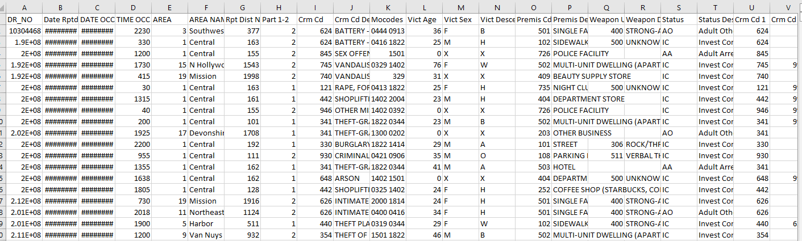
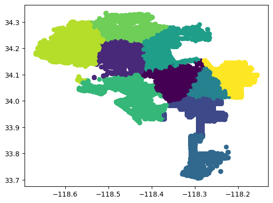
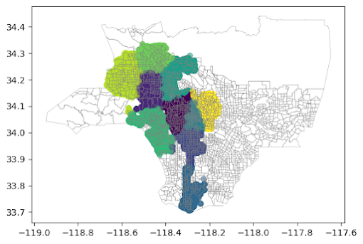
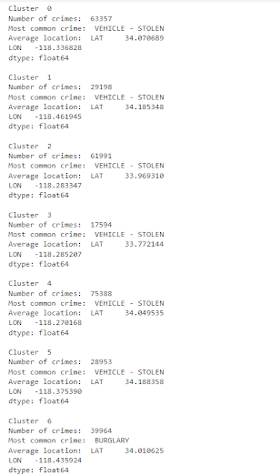
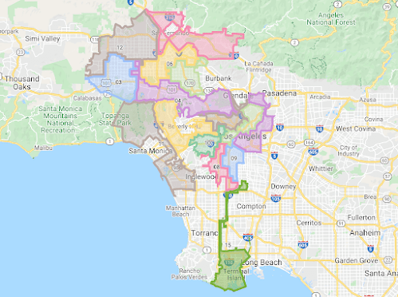
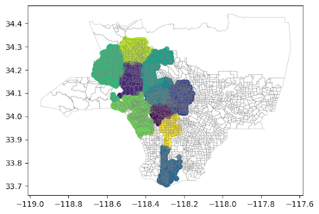

Scraping images from websites can be useful for a variety of tasks, including image classification and training machine learning models. In this post, we will learn how to create an image scraper using Python!

<!--more-->
Today we're going to be learning some basic clustering, mapping, and data science techniques in python. These techniques are important to help organizations gain insight from large amounts of data. It is also a rapidly growing field and in high demand, and having these techniques are highly valuable to organizations.

To do this, we're going to analyze crime data from 2020 to present in LA, which can be found [here](https://catalog.data.gov/dataset/crime-data-from-2020-to-present). Note that I got this data on 15 Dec 2022, so your data will most likely be updated from mine.

------
First, let's take a look at the data. Crime is a major concern for any city, and Los Angeles is no exception.



We have a lot of different things they are tracking, from the date reported and the date the crime occurred, to the crime code, to the address, to victim and perpetrator info like their age, what weapon they used if any, etc. 

Wow! That's a lot of data, and there's been ~620,000+ crimes recorded as of when I downloaded it. Today's post will showcase how to do one specific thing, with the expectation that you can use this knowledge to do this same thing on other data sets, or look at the rest of the data and find other insights.
 
------

What we are going to do today is look for some common areas around LA where crimes take place, and then visualize this on a map. If you have a dataset containing information about crimes and want to visualize the most common ones on a map, Matplotlib and scikit-learn can be useful tools to accomplish this task.

To begin, you will *need to install the necessary libraries*. If you don't have them already, you can install Matplotlib, pandas, geopandas, and scikit-learn by running the following command:

```sh
pip install matplotlib scikit-learn pandas geopandas
```


Once you have the libraries installed, you can start by importing them into your Python script:

```py
import matplotlib.pyplot as plt 
from sklearn.cluster import KMeans
import pandas as pd
import geopandas
```


Next, you will need to load your dataset into a Pandas DataFrame. This will allow you to easily manipulate and analyze the data. Here's an example of how to do this:

```py
#Load the dataset into a DataFrame
df = pd.read_csv('Crime_Data_from_2020_to_Present.csv')

# You can also load your data directly from the API like so. All you need is the URL of the CSV file and you can download it the same way:

df = pd.read_csv('https://data.lacity.org/api/views/2nrs-mtv8/rows.csv?accessType=DOWNLOAD')
```

Next is preprocessing. With machine learning, a lot of time you will have to "massage" your data to make sure it works just how you want it. Importantly, on this data set, crimes with an unknown lat/long have a lat/long of 0,0: Null Island. Obviously this isn't in LA city, so we can delete these data points! It's important to make sure to look at your dataset so you can find any issues with it. 

```py
df = df[(df['LAT'] != 0) & (df['LON'] != 0)]
```


Once you have your data loaded into a DataFrame, you can use scikit-learn's K-Means algorithm to cluster the destinations based on their latitude and longitude. This will allow you to group similar destinations together and identify the ones that are most common. 

K-Means is a clustering algorithm that works by picking 'K' centers, then adding each data point to one of the K clusters based on its distance to the cluster center. The cluster centers are updated at each iteration by computing the mean of all the points within the cluster. The algorithm stops when the cluster centers stop changing or a maximum number of iterations is reached.

Doing it in scikit-learn is really simple! 

```py
# Do a KMeans clustering on the data
kmeans = KMeans(n_clusters=10, random_state=0).fit(df[['LAT', 'LON']])
df['cluster'] = kmeans.labels_
```


Now that you have your data clustered and properly tagged, you can use Matplotlib to create a scatter plot of the destinations on a map. You can use the latitude and longitude columns as the x and y coordinates, and color the points based on their cluster label.

Here's an example of how to do this:

```py
plt.scatter(df['LON'], df['LAT'], c=df['cluster'])
plt.show()
```

This should generate a map with the crime locations plotted as points, with different colors indicating the different clusters:



This is nice, but let's find out how we can do better. We will use geopandas to take census data and display that on the map as well!

`county = geopandas.read_file('Census_Tracts_2020.shx')`


 We now do some preprocessing, such as removing the census tracts that are in the ocean, and removing those above the city limits. This just makes the graph look better. To see the code for this, check the jupyter notebook. (link at bottom) 

```py
county.boundary.plot(color="Gray", linewidth=.25)
# Plot the clusters on the county map
  plt.scatter(df['LON'], df['LAT'], c=df['cluster'], alpha=0.5)
  plt.figure(figsize=(100,100))
  plt.show()
```


You can also customize the appearance of the plot by adding a legend, changing the marker size, or using a different map projection. You can find more information about these customization options in the Matplotlib documentation.

Okay, great! We clustered the data based on lat/long, and displayed it on a map. What does it mean?

-----

## Finding Conclusions from Clustering
Finding conclusions can be a task that's easier said than done. We can start by just looking at the data, and trying to find any trends. We can then try and analyze possible reasons why these trends might exist!


```py
# Find the average location of crimes in each cluster
df.groupby('cluster')[['LAT', 'LON']].mean()

# Print the number of crimes in each cluster, the most common crime, and the average location of crimes in each cluster
for i in range(10):
    print("Cluster ", i)
    print("Number of crimes: ", len(df[df['cluster'] == i]))
    print("Most common crime: ", df[df['cluster'] == i]['Crm Cd Desc'].mode()[0])
    print("Average location: ", df[df['cluster'] == i][['LAT', 'LON']].mean())
    print()
```


The full data can be found at the jupyter notebook. Here are some things that I found whenever I looked at it.

- Interestingly, Cluster 6 has a different most common crime than the other clusters. Cluster 6 is the Westside of the city to the Pacific Ocean (Basically the same as district 11 today!), which is a very wealthy neighborhood. The most common crime in Cluster 6 is "Burglary Residential" which is an uncommon crime in the other clusters.
- Doing a k-means clustering for crime gets a similar result to the actual city council map. Seriously!


Top (Current Districts) and Bottom (Clustered Crime data). 





Keep in mind this isn't a statistics class and really just serves as a tutorial on how you can get started to find conclusions. Please be sure you are not overgeneralizing your conclusion, or forgetting a confounding variable, or many other common mistakes :)


## Conclusions

By using Matplotlib and scikit-learn, you can easily generate a map of data and cluster the data by region. This can be a useful tool for visualizing and analyzing patterns and trends. We learned today how to 